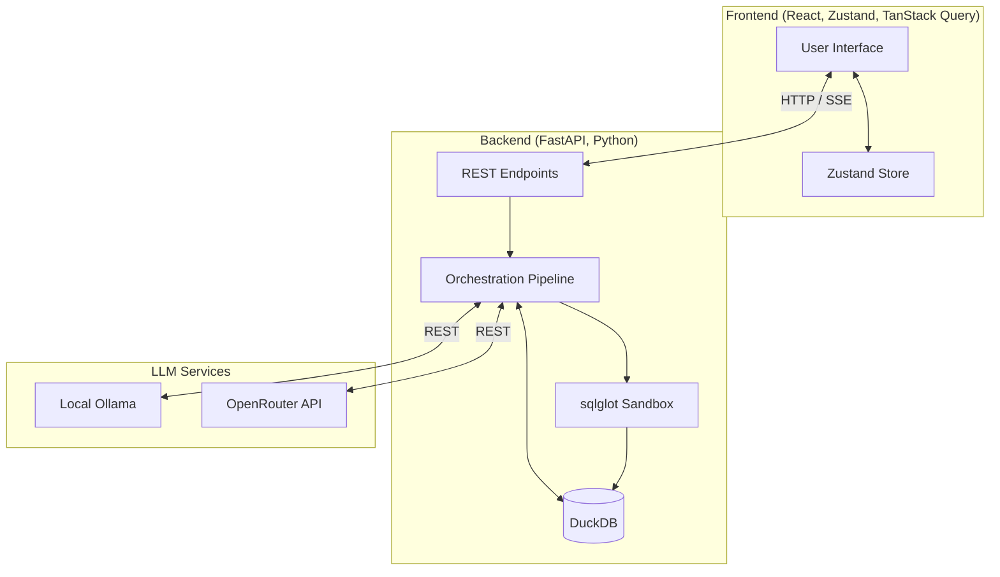
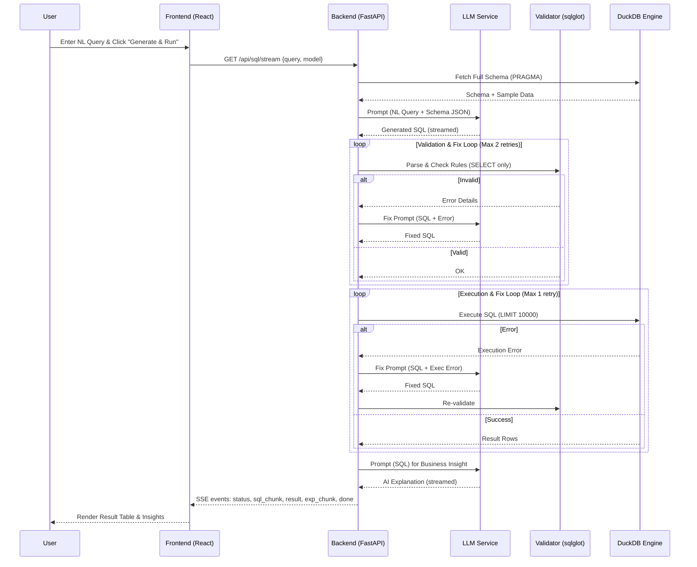
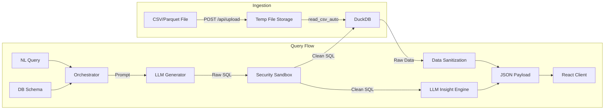

# SQL Query Generator ✨

An AI-powered analytical workspace that lets you query any tabular data using plain English. Upload a CSV or Parquet file, describe what you want to know, and get instant SQL results — no SQL knowledge required.

> **No local GPU? No problem.** The system supports both local Ollama models and free cloud models via **OpenRouter** — zero cost, zero setup friction.

---

## ✨ Features

- 🧠 **Natural Language to SQL** — describe your query in plain English, get DuckDB SQL back instantly
- 🌊 **Streaming Pipeline** — watch SQL generate and results appear token by token via Server-Sent Events
- ☁️ **Cloud LLM Support** — use free OpenRouter models (NVIDIA Nemotron, Gemma 2, Qwen 2) without a GPU
- 🔒 **SQL Security Sandbox** — all generated SQL is validated by `sqlglot`; only `SELECT` is permitted
- 🔁 **Auto-Fix Loop** — if generated SQL fails validation or execution, the AI automatically retries and corrects
- 📊 **Rich Results Table** — paginated, sortable, with CSV/JSON export
- 🤖 **AI Insights** — every query generates an executive-level business analysis alongside the results
- 🌓 **Dark / Light Mode** — full theme support across all pages
- 🗂️ **Schema Browser** — explore your DuckDB tables, column types, and live data previews
- 📁 **Uploaded Files Manager** — manage all ingested datasets from one place
- 💾 **Saved Queries & History** — bookmark and replay any past query
- 🎨 **Monaco Editor** — VS Code-style SQL editor with syntax highlighting

---

## 🏗️ Architecture

### High-Level Architecture



### Detailed Sequence Diagram



### Data Flow Diagram



---

## 🧩 Tech Stack

| Layer | Technology |
| :--- | :--- |
| **Frontend** | React 19, TypeScript, Vite, TailwindCSS v4 |
| **State Management** | Zustand (with localStorage persistence) |
| **Data Fetching** | TanStack Query v5 |
| **SQL Editor** | Monaco Editor |
| **Results Grid** | TanStack Table v8 |
| **Routing** | React Router v7 |
| **Backend** | FastAPI (Python), Uvicorn |
| **Database** | DuckDB (embedded, in-process) |
| **SQL Validation** | sqlglot |
| **LLM (Local)** | Ollama — `qwen2.5-coder:3b` / `7b` |
| **LLM (Cloud)** | OpenRouter (free tier models) |
| **HTTP Client** | httpx (async) |

---

## 🚀 Getting Started

### Prerequisites

- **[Docker Desktop](https://www.docker.com/products/docker-desktop/)** (recommended — handles everything automatically)
- OR manually: **Node.js** `>= 18` + **Python** `>= 3.10`
- **One of the following LLM options:**
  - Option A: [Ollama](https://ollama.com) installed locally
  - Option B: A free [OpenRouter](https://openrouter.ai) API key (no GPU needed)

---

## 🐳 Option A — Run with Docker (Recommended)

Docker is the easiest way to run the project. It starts everything with **one command** — no need to install Python, Node, or manage dependencies manually.

### Step 1 — Clone the repository

```bash
git clone https://github.com/Arthurs-excalibur/Sql-Query-generator.git
cd Sql-Query-generator
```

### Step 2 — Create the `.env` file

Create a file at `backend/.env` with your OpenRouter API key:

```env
OPENROUTER_API_KEY=sk-or-v1-xxxxxxxxxxxxxxxxxxxxxxxx
```

> If you're using local Ollama instead, leave the file empty — just create it so Docker doesn't error.
> ```bash
> echo. > backend\.env   # Windows
> touch backend/.env     # Mac/Linux
> ```

### Step 3 — Build and start

```bash
docker compose up --build
```

Docker will:
1. Build the Python backend image
2. Build and compile the React frontend
3. Start nginx to serve the app and proxy API calls
4. Wire everything together automatically

### Step 4 — Open the app

```
http://localhost:8080
```

That's it! 🎉

### Useful Docker commands

```bash
# Start in background (detached mode)
docker compose up --build -d

# Stop everything
docker compose down

# View backend logs
docker compose logs backend

# Rebuild after code changes
docker compose up --build
```

### How Docker is structured

```
http://localhost:8080 (your browser)
         │
    ┌────▼────────────────────────┐
    │         nginx               │
    │  / → serves React app       │
    │  /api/ → proxies to backend │
    └─────────────────────────────┘
                  │
    ┌─────────────▼───────────────┐
    │    FastAPI backend :3001    │
    │    DuckDB + LLM pipeline    │
    └─────────────────────────────┘
```

Your uploaded data is persisted in a Docker volume (`backend_data`) so it survives container restarts.

---

## 🛠️ Option B — Run Manually (Local Development)

### 1. Clone the Repository

```bash
git clone https://github.com/Arthurs-excalibur/Sql-Query-generator.git
cd Sql-Query-generator
```

### 2. Backend Setup

```bash
cd backend
pip install -r requirements.txt
```

Create `backend/.env`:

```env
OPENROUTER_API_KEY=your_key_here   # Only needed for cloud models
```

Start the backend:

```bash
python main.py
```

The API will be available at `http://localhost:3001`.

### 3. Frontend Setup

From the project root:

```bash
npm install
npm run dev
```

Open your browser at `http://localhost:5173`.

---

## ☁️ Setting Up OpenRouter (Free Cloud LLM — No GPU Required)

If you don't have Ollama installed or don't want to run a local model, you can use **OpenRouter** to access powerful free models like NVIDIA Nemotron, Google Gemma 2, and Qwen 2 — completely free.

### Step-by-Step

**Step 1 — Create an OpenRouter account**

Go to [https://openrouter.ai](https://openrouter.ai) and sign up with your Google or GitHub account. No credit card is required for free models.

**Step 2 — Get your API Key**

1. Click your avatar in the top-right corner
2. Select **"Keys"** from the dropdown
3. Click **"Create Key"**
4. Give it a name (e.g. `sql-generator`) and click **Create**
5. Copy the key (it starts with `sk-or-v1-...`)

**Step 3 — Add the key to your `.env` file**

Inside the `backend/` folder, create or edit the `.env` file:

```env
OPENROUTER_API_KEY=sk-or-v1-xxxxxxxxxxxxxxxxxxxxxxxxxxxxxxxx
```

**Step 4 — Restart the backend**

```bash
# In the backend/ directory
python main.py
```

**Step 5 — Select a cloud model in the app**

1. Open the app at `http://localhost:5173`
2. On the **"Connect Your Data"** setup screen, scroll to **Model Configuration**
3. Under **"Free Cloud Models (OpenRouter API)"**, select your preferred model:

| Model | Best For |
| :--- | :--- |
| **NVIDIA Nemotron** | Highest quality, complex analytical SQL |
| **Google Gemma 2** | Fast, efficient, great for standard queries |
| **Qwen 2 Cloud** | Strong coding model, great SQL generation |
| **Auto-Router** | Let OpenRouter pick the best available model |

**Step 6 — Start querying!**

Upload a CSV file and type a question in plain English. The system will use your selected OpenRouter model to generate and execute the SQL.

> **Note:** Free models have rate limits. If a model is temporarily unavailable, the system automatically falls back through the other free models — so you'll always get a response.

---

## 🔑 Available API Endpoints

| Method | Endpoint | Description |
| :--- | :--- | :--- |
| `GET` | `/api/health` | Backend health check |
| `GET` | `/api/schema` | Fetch full DuckDB schema with column info and previews |
| `POST` | `/api/upload` | Upload a `.csv` or `.parquet` file |
| `GET` | `/api/sql/stream` | Full streaming pipeline (generate → validate → execute → explain) |
| `POST` | `/api/sql/generate` | Generate SQL from a natural language query |
| `POST` | `/api/sql/execute` | Execute a raw SQL string with pagination |
| `POST` | `/api/sql/run` | Non-streaming full pipeline (legacy) |

---

## 🧩 Component Overview

### Frontend Pages

| Component | Route | Description |
| :--- | :--- | :--- |
| `Setup` | `/` | Onboarding — connect data & configure model |
| `Workspace` | `/workspace` | Main query interface |
| `Schema` | `/schema` | Schema browser with DDL viewer |
| `UploadedFiles` | `/files` | Manage ingested datasets |
| `SavedQueries` | `/saved` | Bookmarked queries |
| `History` | `/history` | Full query history |
| `Settings` | `/settings` | Theme & model configuration |

### Key Frontend Components

| Component | Purpose |
| :--- | :--- |
| `QueryInput` | NL input textarea with dynamic smart suggestions |
| `SQLEditor` | Monaco-powered SQL display and editing |
| `ResultTable` | TanStack Table with pagination, CSV/JSON export |
| `AIInsight` | Streaming business analysis panel |
| `SchemaViewer` | Sidebar schema explorer |
| `Sidebar` | Navigation rail with active-route highlighting |

---

## 🔒 Security

- **SQL Injection Prevention** — All generated SQL is parsed by `sqlglot`. Only `SELECT` statements are permitted. Dangerous DuckDB functions (`read_csv_auto` in queries, `COPY`, `EXPORT`) are blocked.
- **Path Traversal Protection** — Uploaded files are stored with UUID-generated names, not the original filename.
- **Secrets Management** — The OpenRouter API key is loaded from `.env` and never exposed to the frontend.

---

## 📁 Project Structure

```
.
├── backend/
│   ├── main.py              # FastAPI app, all endpoints, LLM orchestration
│   ├── requirements.txt     # Python dependencies
│   └── .env                 # API keys (not committed)
├── src/
│   ├── api/
│   │   ├── db.ts            # Upload, schema, execute API calls
│   │   └── llm.ts           # SQL generation & streaming pipeline
│   ├── components/
│   │   ├── QueryInput.tsx   # NL query form with smart suggestions
│   │   ├── SQLEditor.tsx    # Monaco SQL editor
│   │   ├── ResultTable.tsx  # Paginated results grid
│   │   ├── AIInsight.tsx    # Streaming insights panel
│   │   ├── Sidebar.tsx      # Navigation
│   │   └── ...
│   ├── pages/
│   │   ├── Setup.tsx        # Onboarding screen
│   │   ├── Workspace.tsx    # Main workspace
│   │   ├── Schema.tsx       # Schema browser
│   │   ├── Settings.tsx     # Settings page
│   │   └── ...
│   ├── store/
│   │   └── queryStore.ts    # Zustand global state
│   └── index.css            # Design system / theme tokens
├── index.html
├── package.json
└── vite.config.ts
```

---

## 📝 License

MIT — free to use and modify.
