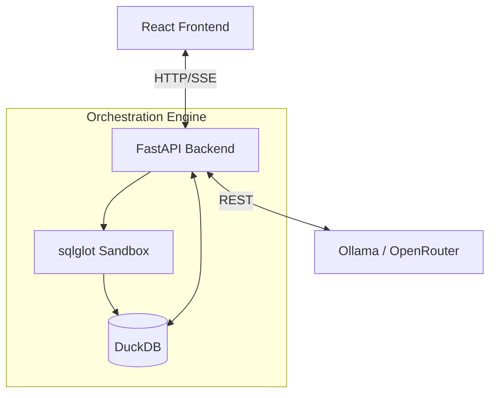

# Excalibur: SQL Query Generator

**Turn plain English into complex, executable SQL queries in seconds.**


Stop wrestling with SQL syntax. Excalibur is an AI-powered analytical workspace that lets you upload tabular data (CSV/Parquet) and query it instantly using natural language. Built for analysts and developers who want immediate answers without writing boilerplate queries or learning new database dialects.

## ⚡ Core Capabilities

- **Natural Language to Valid SQL:** Transform English questions into highly optimized DuckDB SQL.
- **Streaming Intelligence:** Watch SQL generation, data processing, and business insights appear token-by-token with zero perceived latency.
- **Auto-Fix Loop:** If a query fails or syntax is invalid, the AI intercepts the error and automatically corrects the SQL before returning results.
- **Secure Sandboxed Execution:** Integrated with `sqlglot` to strictly enforce `SELECT`-only operations, protecting your data from malicious or destructive commands.
- **Local or Cloud LLMs:** Run 100% locally with Ollama (no data leaves your machine), or use free cloud models via OpenRouter (no GPU required).
- **Executive Insights:** Get a generated business analysis and summary alongside every query result.

## ⚙️ How It Works

1. **Ingest:** Upload your CSV or Parquet files. The schema is automatically inferred and loaded into embedded DuckDB.
2. **Ask:** Type your question in plain English.
3. **Generate & Validate:** The LLM generates SQL based on the schema. The backend intercepts it, validates it for security (read-only), and executes it.
4. **Analyze:** The AI reads the output and streams back a human-readable summary alongside the raw data grid.

## 🚀 Quick Start

Run the entire stack instantly with Docker. No manual dependency setup required.

```bash
git clone https://github.com/Arthurs-excalibur/Sql-Query-generator.git
cd Sql-Query-generator

# Create an empty .env file (or add your OpenRouter API key)
echo OPENROUTER_API_KEY= > backend/.env

# Build and start
docker compose up --build
```

*Open `http://localhost:8080` in your browser.*

## 🏗️ Architecture

A clean, decoupled pipeline separating the user interface from the embedded analytical engine and LLM orchestration.



## 📚 Documentation

Deep-dive technical documentation is available in the [`/docs` folder](./docs/):

- [Architecture & Diagrams](./docs/architecture.md) — Sequence diagrams and data flow.
- [Developer Guide](./docs/developer_guide.md) — Tech stack, local development setup, component overview, and API references.

## 📝 License

MIT — free to use, modify, and distribute.
