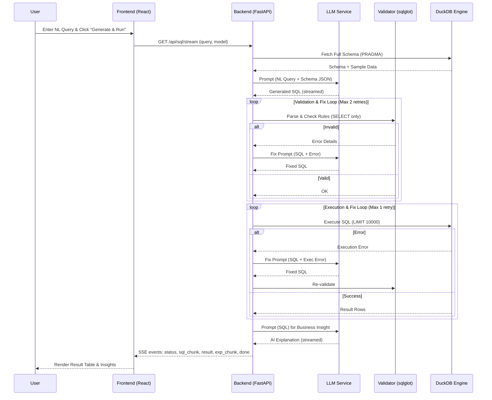
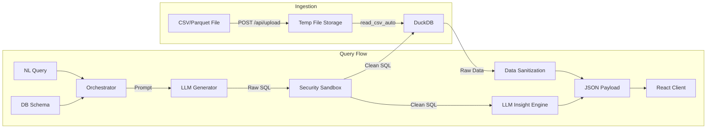

# Architecture Details

This document contains deep-dive architectural diagrams for the SQL Query Generator.

## Detailed Sequence Diagram

```mermaid
sequenceDiagram
    participant User
    participant UI as Frontend (React)
    participant API as Backend (FastAPI)
    participant LLM as LLM Service
    participant Val as Validator (sqlglot)
    participant DB as DuckDB Engine

    User->>UI: Enter NL Query & Click "Generate & Run"
    UI->>API: GET /api/sql/stream {query, model}
    
    API->>DB: Fetch Full Schema (PRAGMA)
    DB-->>API: Schema + Sample Data
    
    API->>LLM: Prompt (NL Query + Schema JSON)
    LLM-->>API: Generated SQL (streamed)
    
    loop Validation & Fix Loop (Max 2 retries)
        API->>Val: Parse & Check Rules (SELECT only)
        alt Invalid
            Val-->>API: Error Details
            API->>LLM: Fix Prompt (SQL + Error)
            LLM-->>API: Fixed SQL
        else Valid
            Val-->>API: OK
        end
    end
    
    loop Execution & Fix Loop (Max 1 retry)
        API->>DB: Execute SQL (LIMIT 10000)
        alt Error
            DB-->>API: Execution Error
            API->>LLM: Fix Prompt (SQL + Exec Error)
            LLM-->>API: Fixed SQL
            API->>Val: Re-validate
        else Success
            DB-->>API: Result Rows
        end
    end
    
    API->>LLM: Prompt (SQL) for Business Insight
    LLM-->>API: AI Explanation (streamed)
    
    API-->>UI: SSE events: status, sql_chunk, result, exp_chunk, done
    UI-->>User: Render Result Table & Insights
```

## Data Flow Diagram

```mermaid
graph LR
    subgraph Ingestion
        Upload[CSV/Parquet File] --> |POST /api/upload| BackendFS[Temp File Storage]
        BackendFS --> |read_csv_auto| Duck[DuckDB]
    end
    
    subgraph Query Flow
        Query[NL Query] --> Orch[Orchestrator]
        DuckDB_Schema[DB Schema] --> Orch
        Orch --> |Prompt| LLM[LLM Generator]
        LLM --> |Raw SQL| Sec[Security Sandbox]
        Sec --> |Clean SQL| Duck
        Duck --> |Raw Data| Formatting[Data Sanitization]
        Sec --> |Clean SQL| LLM2[LLM Insight Engine]
        Formatting --> JSON[JSON Payload]
        LLM2 --> JSON
        JSON --> Client[React Client]
    end
```
