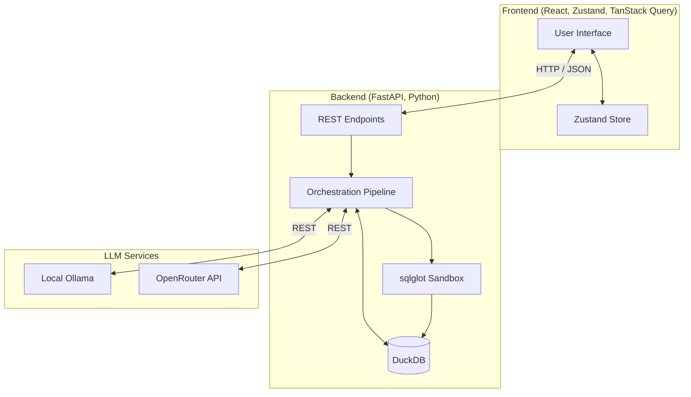
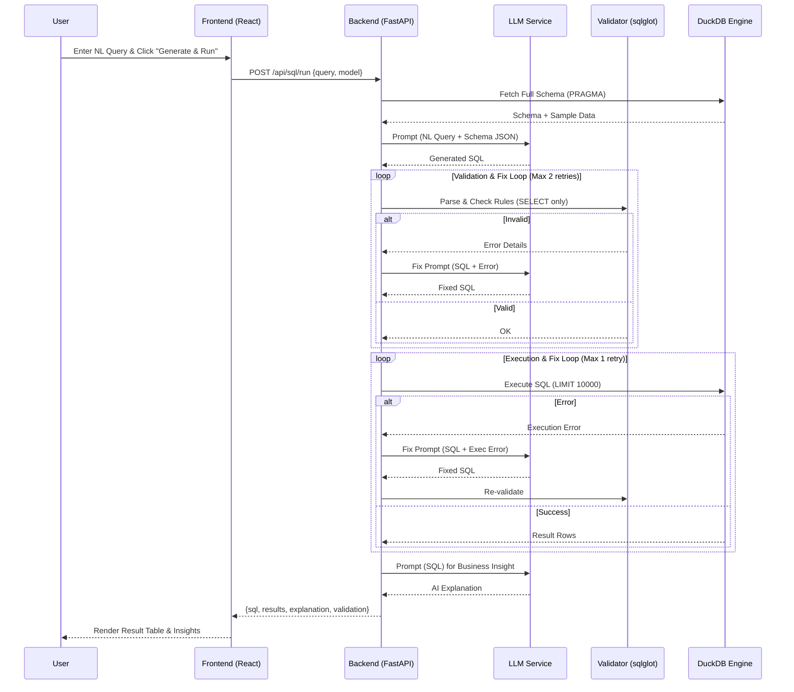
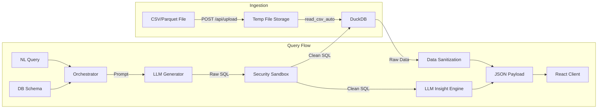

# System-Level Analysis: SQL Query Generator

## 1. System Overview

The SQL Query Generator is an AI-powered analytical workspace that allows users to query tabular data (CSV/Parquet via DuckDB) using natural language. 

The application follows a **Synchronous Orchestration Pattern**. The user submits a natural language query, and the backend orchestrates a multi-step pipeline: extracting the database schema, prompting an LLM (local Ollama or remote OpenRouter) to generate DuckDB-flavored SQL, validating the SQL against a security sandbox (`sqlglot`), automatically retrying on syntax errors, executing the query against DuckDB, generating AI-driven business insights, and finally returning the complete payload to a React/Zustand frontend.

## 2. High-Level Architecture Diagram

## 3. Detailed Sequence Diagram

## 4. Data Flow Diagram

## 5. Component Breakdown

### Frontend Components
*   **`QueryInput`**: Captures user input. Manages TanStack `useMutation` hooks for generation and execution. Handles abort controllers for cancellation.
*   **`SQLEditor`**: Displays the raw SQL output. Allows users to view and manually copy the generated SQL.
*   **`ResultTable`**: Uses TanStack Table for client-side pagination, sorting, and rendering of the DuckDB result set. Handles CSV/JSON exports.
*   **`AIInsight`**: Renders the LLM-generated business explanation of the executed query.
*   **`queryStore` (Zustand)**: The central nervous system. Maintains global state for history, active query, current result set, schema configurations, and UI themes.

### Backend Components
*   **API Router (`main.py`)**: Exposes FastAPI endpoints (`/api/sql/generate`, `/api/sql/execute`, `/api/sql/run`, `/api/upload`).
*   **Schema Service**: Executes `PRAGMA table_info` against DuckDB to build a JSON representation of all tables, columns, and 5 sample rows.
*   **LLM Interface (`_call_llm`)**: Unified asynchronous HTTP client that routes to either local Ollama or OpenRouter. Implements automatic failover/fallback for free OpenRouter models.
*   **Validation Sandbox (`validate_sql`)**: Uses the `sqlglot` AST parser. Enforces `SELECT` only statements and recursively walks the AST to block dangerous DuckDB functions (e.g., `read_csv`, `install_extension`).
*   **Execution Engine**: Single-threaded DuckDB connection wrapped in a standard `threading.Lock()` (`db_lock`) to prevent concurrent mutation errors.

## 6. Flow Inefficiencies & Bottlenecks

1.  **Synchronous "God" Request**: The `/api/sql/run` endpoint blocks until generation, validation (and potential LLM retries), execution, and insight generation *all* finish. This leads to massive TTFB (Time to First Byte) latency.
2.  **Sequential Insight Generation**: The LLM is queried for business insights *after* the database execution completes. This adds 2-5 seconds of dead time before the user sees the data that is already fetched.
3.  **Unbounded Schema Context**: The system dumps the *entire* database schema (including sample rows) into the LLM prompt. As the database grows, this will cause token limit explosions, massive latency spikes, and increased API costs.
4.  **Client-Side Pagination**: The backend fetches up to 10,000 rows (`LIMIT 10000`) and serializes them into a single massive JSON response. This causes extreme network latency, heavy backend memory usage, and browser UI freezes when rendering TanStack Table.
5.  **Global Thread Locking**: The backend uses a single `db_lock` for *all* DuckDB interactions (including schema reads). One slow query will block the entire application for all concurrent requests.

## 7. Failure Points

1.  **Context Window Overflow**: Uploading 20 files with many columns will make the `get_schema()` JSON too large for `qwen2.5-coder:3b` (or other local models) to process, causing outright generation failure.
2.  **LLM Hallucination Loop**: If the LLM generates a syntactically valid query referencing non-existent columns, the execution fails. The retry loop asks the LLM to fix it. If the LLM repeatedly fails to fix it within the retry limit, the pipeline breaks.
3.  **JSON Serialization Exhaustion**: Executing a query that returns 10,000 rows of large text fields will cause Python to struggle during `sanitize_data` dict conversion, potentially hitting OOM (Out of Memory) or timeout limits.
4.  **Zombie Queries (Lack of DB Cancellation)**: The frontend `QueryInput` implements an `AbortController` to close the HTTP connection. However, FastAPI does not interrupt the underlying DuckDB execution or the outgoing HTTP request to the LLM. The server wastes resources completing abandoned tasks.
5.  **sqlglot Dialect Mismatch**: `sqlglot` parses DuckDB dialect, but if DuckDB introduces a new syntax feature the LLM utilizes, `sqlglot` may fail to parse it, triggering a false-positive validation error.

## 8. Missing Pieces

1.  **Server-Side Events (SSE) / Streaming**: No real-time feedback. The user waits 10-15 seconds looking at a spinner. SQL generation, execution status, and explanations should be streamed.
2.  **Semantic Schema Search (RAG)**: The system lacks a mechanism to filter the schema down to only the tables relevant to the user's prompt via embeddings/vector search.
3.  **Server-Side Pagination**: The backend lacks standard `OFFSET`/`LIMIT` API implementation for the `ResultTable` to fetch data in chunks.
4.  **Query Interrupt Integration**: Missing `duckdb.interrupt()` wiring to safely kill long-running runaway queries based on client disconnects.
5.  **Telemetry & Cost Tracking**: No structured logging for token usage, pipeline step duration, or LLM failure rates.

## 9. Recommended Improved System Design

To evolve this from a prototype to a production-grade enterprise system, the architecture should be refactored as follows:

1.  **Decouple & Stream (Event-Driven UI)**:
    *   Transition from REST to Server-Sent Events (SSE) or WebSockets.
    *   Stream the generated SQL token-by-token so the user sees progress.
    *   Immediately stream the first page of results (50 rows) once executed.
    *   Generate the AI Insight in parallel with the database execution, streaming the text back to the UI concurrently.
2.  **Vectorized Schema Injection (RAG)**:
    *   Implement an embedding layer. When a user asks "Show me highest revenue", search for table metadata matching "revenue" and only inject those 2-3 tables into the LLM context, keeping prompts fast and cheap.
3.  **Read-Replica Concurrency**:
    *   Remove the global `db_lock`. Open multiple DuckDB read-only connections (`duckdb.connect('data.db', read_only=True)`) for parallel query execution. Keep a single background worker process for writing/uploading data.
4.  **True Query Cancellation**:
    *   Bind FastAPI's `request.is_disconnected()` to the execution engine. If the user clicks "Cancel" (aborting the fetch request), trigger `duckdb.interrupt()` on that specific connection to free server resources instantly.
5.  **Server-Side Pagination**:
    *   Modify `/api/sql/execute` to accept `page` and `pageSize`. Use DuckDB's native pagination to return lightweight JSON payloads, keeping the frontend snappy regardless of dataset size.
